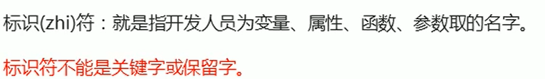
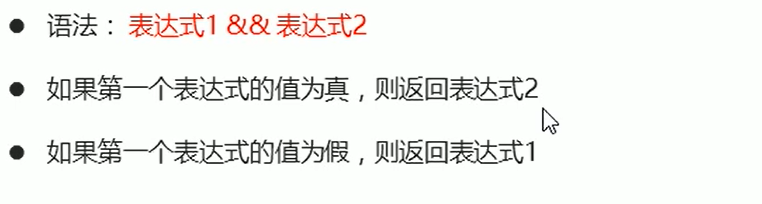

# JavaScript
**JS是面向过程的语言而不是面向对象的语言**

    面向过程的语言三大特征：顺序，选择和循环
    面向对象的语言三大特征：封装，继承和多态
    面向过程的语言没有面向对的语言三大特征（如果有就是模拟的），但是面向对象的语言有面向过程的三大特征
 ## 一、计算机编程基础
 
 ### 1.编程语言
#### 1.1 编程
    
#### 1.2 计算机语言
    
#### 1.3 编程语言
    
#### 1.4 翻译器
    
#### 1.5 编程语言(动)和标记语言(静)的区别
    

---------------------------------------------

### 2.计算机基础
#### 2.1 计算机组成
    
    软件是运行在硬件上的
#### 2.2 数据存储
    
#### 2.3 数据存储单位
    
#### 2.4 程序运行
    

==============================================
## 二、初识JavaScript

### 1.初识JavaScript

 #### 1.1 JavaScript 历史

#### 1.2 JavaScript 是什么

 #### 1.3 JavaScript 的作用

 #### 1.4 HTML/CSS/JS 的关系

**HTML**是显示数据

**CSS**是为了更友好的呈现数据（排版让客户更易观看）

**JS**是一种运行于JavaScript解释器/引擎中的解释型脚本(逐一执行)语言{JS操作数据}

 #### 1.5 浏览器执行JS简介

 浏览器内核由两个部分组成：
            1）内容排版引擎解析HTML和CSS
            2）脚本解析引擎解析javascript
                 ps:不同浏览器的内核是不同

#### 1.6 JS的组成

    1.ECMAScript 是js基础语法
    
    2.DOM(文档对象模型)
    
    3.BOM(浏览器对象模型)
    
#### 1.7 JS 初体验

        js的书写位置有三种行内，内嵌和外部
1. 行内式js
        
2. 内嵌js
         
3. 外部js文件
         
ps：内嵌的先被执行外部后被执行

--------------------------------------------

### 2. JS 注释

--------------------------------------

### 3. JS输入输出语句

#### 3.1 prompt()
    
    
#### 3.2 alert()
    
    
#### 3.3 console.log()
    
    

==========================================
## 三、变量

### 1. 变量概述
#### 1.1  什么是变量

#### 1.2 变量在内存中存储

-----------------------------------------
### 2. 变量的使用
变量在使用时分为两步：1.声明变量 2.赋值
#### 2.1 声明变量

#### 2.2 赋值

#### 2.3 变量的初始化

------------------------------------------
### 3 变量的语法扩展
#### 3.1 更新变量

ps:后写覆盖先写
#### 3.2 同时声明多个变量

#### 3.3 声明变量的特殊情况

-------------------------------------
### 4.变量的命名规范

    1. 不允许使用js的关键字和保留关键字
    2.由字母、数字、下划线以及$组成
    3.不能以数字开头
    4.尽量见名知意
    5.可以采用驼峰命名法（合成词第一个单词字母小写，第二个单词字母大写）
### 5.小结

===================================
## 四、数据类型

### 1.数据类型简介
#### 1.1 为什么需要数据类型

#### 1.2 变量的数据类型

#### 1.3 数据类型的分类

-------------------------------
### 2.简单数据类型

#### 2.1 简单数据类型（基本数据类型）

#### 2.2 数字型 *Number* (整数和浮点数(小数))
 1） 数字型进制
    

 2） 数字型范围
    

 3） 数字型三个特殊值
    
    
    
NaN：即非数值（Not a Number）是一个特殊的数值

        var age = 18;

        console.log(age-"abc")

    //  因为数值无法减字符串故会返回一个NaN

        PS:    1.任何涉及NaN的操作（列如NaN/10）都会返回NaN.
               2.NaN与任何值都不相等，包括NaN本身。
isNaN(n)：检测n是否是“非数值” 返回值为Boolean值

#### 2.3 字符串型 *String*

1）字符串引号嵌套

2） 字符串转义符
   
    ps：字符串转义字符都是用\开头 但是这些转义字符要写到引号里
3）字符串长度

4） 字符串拼接

5）字符串拼接加强

案列：

#### 2.4 布尔值 *Boolean*

#### 2.5 未定义类型 *Undefind* 和 空值 *null*
Undefind: 申明一个变量但不给他赋值

    var addert;//未定义类型
    console.log(typeof addert)
null:

    var setting=null;//null空值
    console.log(setting)

PS:  undefined值是派生自null值的，所以undefined==null的返回结果是true。

----------------------------------------
### 3.获取变量数据类型

#### 3.1 获取检测变量的数据类型
1）typeof可用来获取检测变量的数据类型

2）字面量也可以判断数据类型

    字面量是在源代码中一个固定值的表示法,通俗来说,就是字面量表示如何表达这个值。

蓝色：数字类型
黑色：字符串
深蓝：布尔值
灰色：未定义，空

----------------------------------------
### 4. 数据类型转换

#### 4.1 什么是数据类型转换

#### 4.2 转换为字符串

#### 4.3 转换为数字型 (重点)

1）parseInt(string)函数和parseFloat(string)函数(重点)
    
2）强制转换 Number和隐式转换（/，*，-）

#### 4.4 转换为布尔值

==========================================

## 五、扩展阅读

### 1. 解释型语言和编译型语言

#### 1.1 概述

#### 1.2 执行过程

----------------------------

### 2.标识符、关键字、保留字
#### 2.1 标识符

#### 2.2 关键字

#### 2.3 保留字

==========================================
## 六、JavaScript运算符

### 1. 运算符

-----------------------------
### 2. 算数运算符
#### 2.1 算数运算符概述

#### 2.2 浮点数的精度问题

#### 2.3 课堂提问

#### 2.4 表达式和返回值

----------------------------
### 3. 递增和递减运算符
#### 3.1 递增和递减运算符概述

#### 3.2 递增运算符
1）前置递增运算符

2）后置递增运算符

eg:

#### 3.3 前置递增和后置递增小结

-----------------------------
### 4. 比较运算符

#### 4.1 比较运算符概述

#### 4.2 = 小结

-------------------------------
### 5. 逻辑运算符

#### 5.1 逻辑运算符概述

#### 5.2 逻辑与 &&

#### 5.3 逻辑或 ||

#### 5.4 逻辑非 ！

#### 5.5 短路运算（逻辑中断）

1） 逻辑与

2）逻辑或

-----------------------------------
### 6. 赋值运算符

------------------------------------
### 7. 运算符优先级

============================================

## 七、JavaScript 流程控制-分支

### 1. 流程控制

------------------------------
### 2. 顺序流程控制

-------------------------------------
### 3. 分支流程控制if语句
#### 3.1 分支结构

#### 3.2 if 语句
1）语法结构
 

 2）执行流程

#### 3.3 if else 语句（双分支语句）
1）语法结构

2）执行流程

#### 3.4 if else if 语句（多分支语句）
1）语法结构

2）执行流程

（3）else if 中间有个空格
eg:

-------------------------------------
### 4. 三元表达式
三元表达式也能做一些简单的条件选择,有三元运算符组成的式子称为三元表达式。

-------------------------------------
### 5. 分支流程控制switch语句

#### 5.1 语法结构

#### 5.2 switch 注意事项

=============================================
##### 分支结构（选择结构） 

if语法
 
      if（一个具有逻辑值结果的表达式）{.
            当【小阔号】中的逻辑值为真的时候，需要执行的代 码
         }
        if分支结构的判断条件如果为假，则if结构等于不存在

        //扩展  

        else
            else不能单独使用，总是会与距离最近 的if-else结构
            表示如果满足条件执行某事，否则执行某事的二元判断结构

#### 三种引用数据类型
1）数组类型（）
2）对象类型（） 
js Object对象类型
   对象是由大括号包裹的 
3）函数类型（）
当var没有声明是用delete删除时会被删除，而用var申明用delete是删除不了的 

原型是公共的列如每个人都有两只眼睛

原型链是连接父级与子集的桥梁
prototype  原型
__proto__  原型指向 
在修改原型是数组时，后面的值不被污染
事件对象是系统添加的是隐藏的
事件传递