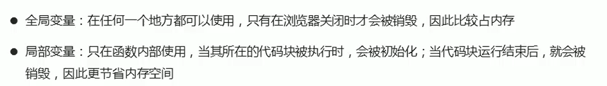

# JavaScript
**JS是面向过程的语言而不是面向对象的语言**

    面向过程的语言三大特征：顺序，选择和循环
    面向对象的语言三大特征：封装，继承和多态
    面向过程的语言没有面向对的语言三大特征（如果有就是模拟的），但是面向对象的语言有面向过程的三大特征
## 一、计算机编程基础
 
### 1.编程语言
#### 1.1 编程

#### 1.2 计算机语言

#### 1.3 编程语言

#### 1.4 翻译器

#### 1.5 编程语言(动)和标记语言(静)的区别

---------------------------------------------

### 2.计算机基础
#### 2.1 计算机组成

    软件是运行在硬件上的
#### 2.2 数据存储

#### 2.3 数据存储单位

#### 2.4 程序运行

==============================================
## 二、初识JavaScript

### 1.初识JavaScript

#### 1.1 JavaScript 历史

#### 1.2 JavaScript 是什么

#### 1.3 JavaScript 的作用

#### 1.4 HTML/CSS/JS 的关系

**HTML**是显示数据

**CSS**是为了更友好的呈现数据（排版让客户更易观看）

**JS**是一种运行于JavaScript解释器/引擎中的解释型脚本(逐一执行)语言{JS操作数据}

#### 1.5 浏览器执行JS简介

 浏览器内核由两个部分组成：
            1）内容排版引擎解析HTML和CSS
            2）脚本解析引擎解析javascript
                 ps:不同浏览器的内核是不同

#### 1.6 JS的组成

    1.ECMAScript 是js基础语法
    
    2.DOM(文档对象模型)
    
    3.BOM(浏览器对象模型)
    
#### 1.7 JS 初体验

        js的书写位置有三种行内，内嵌和外部
1. 行内式js
        
2. 内嵌js
         
3. 外部js文件
         
ps：内嵌的先被执行外部后被执行

--------------------------------------------

### 2. JS 注释

--------------------------------------

### 3. JS输入输出语句

#### 3.1 prompt()
    
    
#### 3.2 alert()
    
    
#### 3.3 console.log()
    
    

==========================================
## 三、变量

### 1. 变量概述
#### 1.1  什么是变量

#### 1.2 变量在内存中存储

-----------------------------------------
### 2. 变量的使用
变量在使用时分为两步：1.声明变量 2.赋值
#### 2.1 声明变量

#### 2.2 赋值

#### 2.3 变量的初始化

------------------------------------------
### 3 变量的语法扩展
#### 3.1 更新变量

ps:后写覆盖先写
#### 3.2 同时声明多个变量

#### 3.3 声明变量的特殊情况

-------------------------------------
### 4.变量的命名规范

    1. 不允许使用js的关键字和保留关键字
    2.由字母、数字、下划线以及$组成
    3.不能以数字开头
    4.尽量见名知意
    5.可以采用驼峰命名法（合成词第一个单词字母小写，第二个单词字母大写）
### 5.小结

===================================
## 四、数据类型

### 1.数据类型简介
#### 1.1 为什么需要数据类型

#### 1.2 变量的数据类型

#### 1.3 数据类型的分类

-------------------------------
### 2.简单数据类型

#### 2.1 简单数据类型（基本数据类型）

#### 2.2 数字型 *Number* (整数和浮点数(小数))
 1） 数字型进制
    

 2） 数字型范围
    

 3） 数字型三个特殊值
    
    
    
NaN：即非数值（Not a Number）是一个特殊的数值

        var age = 18;

        console.log(age-"abc")

    //  因为数值无法减字符串故会返回一个NaN

        PS:    1.任何涉及NaN的操作（列如NaN/10）都会返回NaN.
               2.NaN与任何值都不相等，包括NaN本身。
isNaN(n)：检测n是否是“非数值” 返回值为Boolean值

#### 2.3 字符串型 *String*

1）字符串引号嵌套

2） 字符串转义符
   
    ps：字符串转义字符都是用\开头 但是这些转义字符要写到引号里
3）字符串长度

4） 字符串拼接

5）字符串拼接加强

案列：

#### 2.4 布尔值 *Boolean*

#### 2.5 未定义类型 *Undefind* 和 空值 *null*
Undefind: 申明一个变量但不给他赋值

    var addert;//未定义类型
    console.log(typeof addert)
null:

    var setting=null;//null空值
    console.log(setting)

PS:  undefined值是派生自null值的，所以undefined==null的返回结果是true。

----------------------------------------
### 3.获取变量数据类型

#### 3.1 获取检测变量的数据类型
1）typeof可用来获取检测变量的数据类型

2）字面量也可以判断数据类型

    字面量是在源代码中一个固定值的表示法,通俗来说,就是字面量表示如何表达这个值。

蓝色：数字类型
黑色：字符串
深蓝：布尔值
灰色：未定义，空

----------------------------------------
### 4. 数据类型转换

#### 4.1 什么是数据类型转换

#### 4.2 转换为字符串

#### 4.3 转换为数字型 (重点)

1）parseInt(string)函数和parseFloat(string)函数(重点)
    
2）强制转换 Number和隐式转换（/，*，-）

#### 4.4 转换为布尔值

==========================================

## 五、扩展阅读

### 1. 解释型语言和编译型语言

#### 1.1 概述

#### 1.2 执行过程

----------------------------

### 2.标识符、关键字、保留字
#### 2.1 标识符

#### 2.2 关键字

#### 2.3 保留字

==========================================
## 六、JavaScript运算符

### 1. 运算符

-----------------------------
### 2. 算数运算符
#### 2.1 算数运算符概述

#### 2.2 浮点数的精度问题

#### 2.3 课堂提问

#### 2.4 表达式和返回值

----------------------------
### 3. 递增和递减运算符
#### 3.1 递增和递减运算符概述

#### 3.2 递增运算符
1）前置递增运算符

2）后置递增运算符

eg:

#### 3.3 前置递增和后置递增小结

-----------------------------
### 4. 比较运算符

#### 4.1 比较运算符概述

#### 4.2 = 小结

-------------------------------
### 5. 逻辑运算符

#### 5.1 逻辑运算符概述

#### 5.2 逻辑与 &&

#### 5.3 逻辑或 ||

#### 5.4 逻辑非 ！

#### 5.5 短路运算（逻辑中断）

1） 逻辑与

2）逻辑或

-----------------------------------
### 6. 赋值运算符

------------------------------------
### 7. 运算符优先级

============================================

## 七、JavaScript 流程控制-分支

### 1. 流程控制

------------------------------
### 2. 顺序流程控制

-------------------------------------
### 3. 分支流程控制if语句
#### 3.1 分支结构

#### 3.2 if 语句
1）语法结构
 

 2）执行流程

#### 3.3 if else 语句（双分支语句）
1）语法结构

2）执行流程

#### 3.4 if else if 语句（多分支语句）
1）语法结构

2）执行流程

（3）else if 中间有个空格
eg:

     if语法
        if（一个具有逻辑值结果的表达式）{.
                当【小阔号】中的逻辑值为真的时候，需要执行的代 码
            }
            if分支结构的判断条件如果为假，则if结构等于不存在

            //扩展  

            else
                else不能单独使用，总是会与距离最近 的if-else结构
                表示如果满足条件执行某事，否则执行某事的二元判断结构

-------------------------------------
### 4. 三元表达式
三元表达式也能做一些简单的条件选择,有三元运算符组成的式子称为三元表达式。

-------------------------------------
### 5. 分支流程控制switch语句

#### 5.1 语法结构

switch 注意事项

#### 5.2 switch 语句和 if else if的区别

===================================

## 八、JavaScript 流程控制-循环

### 1. 循环

-------------------------------------
### 2. for 循环

#### 2.1 语法结构

#### 2.2 for 循环重复相同的代码

#### 2.3 for 循环重复不相同的代码
for循环还可以重复不同的代码,这进要是因为使用了计数器,计数器在每次循环过程中都会有变化。

#### 2.4 for 循环重复某些相同操作
for循环因为有了计数器的存在,我们还可以重复的执行某些操作, 比如做一些算术运算。

eg1；
学生成绩案列

eg2:
追加字符串形式 var str = ' ';

-------------------------------
### 3. 双重 for 循环

#### 3.1 双重 for 循环概述

eg1:

eg2:

#### 3.2 for 循环小结

-----------------------------------
### 4. while 循环

----------------------------------
### 5. do while 循环

##### 循环小结

-----------------------------------
### 6. continue break

#### 6.1 continue 关键字

#### 6.2 break 关键字

========================================

 ## 九、JavaScript 命名规范以及语法格式

 ### 1. 标识符命名规范

 -------------------------------
 ### 2. 操作符规范

 -----------------------------------
 ### 3. 单行注释规范

 -------------------------------------
 ### 4. 其他规范

 

 ##### 循环作业

 

=========================================
## 十、 JavaScript 数组

### 1. 数组的概念

----------------------------------------
### 2. 创建数组
#### 2.1 数组的创建方式

#### 2.2 利用 new 创建数组

#### 2.3 利用数组字面量创建数组

#### 2.4 数组元素的类型

----------------------------------------
### 3. 获取数组中的元素

#### 3.1 数组的索引

---------------------------------
### 4. 遍历数组
遍历:就是把数组中的每个元素从头到尾都访问次(类似我们每天早上学生的点名)。

#### 数组元素

eg:

------------------------------------
### 5. 数组中新增元素
可以通过修改length长度以及索引号增加数组元素
#### 5.1 通过修改 length 长度新增数组元素

#### 5.2 通过修改数组索引新增数组元素

如果有就替换元素
eg1:
方法1:

方法2:

-----------------------------------
### 6. 数组案列
eg1:

###### 冒泡排序:

=========================================
## 十一、 JavaScript 函数

### 1. 函数的概念

------------------------
### 2. 函数的使用
函数在使用时分为两步:声明函数和调用函数。
#### 2.1 声明函数

#### 2.2 调用函数

####  2.3 函数的封装

-----------------------
### 3. 函数的参数
#### 3.1 形参和实参

    3.注意点
    (1) 多个参数之间用逗号隔开
    (2)形参可以看做是不用声明的变量

#### 3.2 函数形参和实参个数不匹配问题

#### 3.3 小结

-----------------------
### 4.函数的返回值
#### 4.1 return 语句

#### 4.2 return 终止函数

#### 4.3 return 的返回值

#### 4.4 函数没有return返回undefined

#### 4.5 break ,continue ,return的区别

---------------------
### 5. arguments 的使用

-------------------------
### 6. 函数案列

------------------------
### 7. 函数的两种声明方式

===========================================
## 十二、 JavaScript 作用域

### 1. 作用域

#### 1.1 作用域概述

--------------------------------
### 2. 变量的作用域
#### 2.1 变量作用域分类

#### 2.2 全局变量

#### 2.3 局部变量

#### 2.4 全局变量和局部变量的区别

-----------------------------------
### 3. 作用域链
站在目标出发，一层一层的往外查找

### 4. JS 没有块级作用域

===========================================
## 十三、JavaScript 预解析

### 1.预解析

---------------------------------
### 2. 变量预解析和函数预解析

----------------------------------
### 3. 预解析案列 

=========================================

## 十四、 JavaScript 对象

### 1. 对象
对象是由大括号包裹的 
#### 1.1 什么是对象？

#### 1.2 为什么需要对象

--------------------------------
### 2. 创建对象的三种方式

#### 2.1 利用字面量创建对象

键（属性名：） 值（属性值）对  .（的）
方法后面跟的是一个匿名函数

#### 2.2 利用 new Object 创建对象

#### 2.3 利用构造函数创建对象

#### 2.4 构造函数和对象

----------------------------------
### 3. new 关键字

-----------------------------------
### 4. 遍历对象属性
    对象里的元素是无序的，for 循环必须要有 var 计数器，
    传统的for循环是不能遍历打印这些属性，
    所以需要用for in来对对象进行操作

### 小结

### 作业
对象

函数

=============================================
## 十五、JavaScript 内置对象

### 1. 内置对象

----------------------------------------
### 2. 查文档

#### 2.1 MDN

#### 2.2 如何学习对象中的方法

-------------------------------------------
### 3. Math 对象

#### 3.1 Math 概述

#### 3.2 随机数方法 random()
    Math. random()函数返回一个浮点，伪随机数在范围[0, 1),
    也就是说，从0 (包括0)往上，但是不包括1 (排除1 ) , 然后
    您可以缩放到所需的范围。实现将初始种子选择到随机数生成算
    法;它不能被用户选择或重置。

    可以去MDN中去查，可以做随机点名

--------------------------------------
### 4. 日期对象
#### 4.1 Date 概述

#### 4.2 Date()方法的使用

#### 4.3 日期格式化

#### 4.4 获取日期的总的毫秒形式(时间戳)
    永不重复

1秒 = 1000毫秒

#### 4.5 倒计时案列
案列分析

------------------------------------
### 5. 数组对象

#### 5.1 数组对象的创建

#### 5.2 检测是否为数组

#### 5.3 添加删除数组元素的方法

添加

删除

#### 5.4 数组排序

#### 5.5 数组索引方法

-----------------------------------
### 6. 字符串对象

==============================================

原型是公共的列如每个人都有两只眼睛

原型链是连接父级与子集的桥梁
prototype  原型
__proto__  原型指向 
在修改原型是数组时，后面的值不被污染
事件对象是系统添加的是隐藏的
事件传递

==========================================================

### JavaScript中的classList的使用
动态控制元素的样式

　　style[样式名] = 值

　　增删改class的方式

classList下的方法

　　增加 class — node.classList.add()

　　删除 class — node.classList.remove()

　　切换 class — node.classist.toggle()

　　判断 class — node.classist.contains()

知识点

　　cssText 设置多个样式，跟写在行间一样的写法

======================================================================